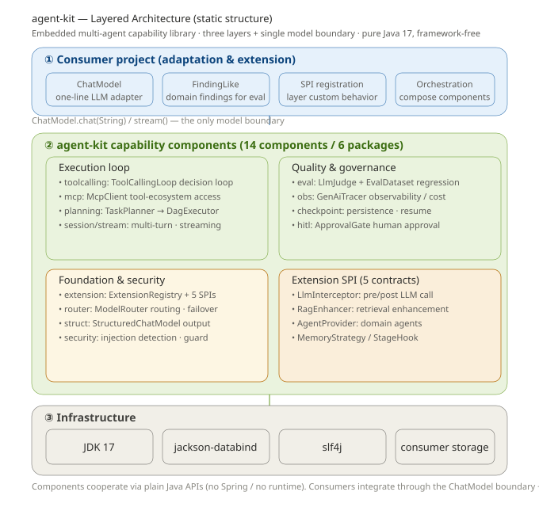

# agent-kit

> [English](README.md) | [中文](README.zh-CN.md) | [📖 Documentation](https://13liyunfei.github.io/agent-kit/)

[](https://13liyunfei.github.io/agent-kit/)

Reusable multi-agent capability kit — plug in as a Maven component, extend via SPI.

Pure Java 17, framework-free (only jackson-databind + slf4j). Any multi-agent project can adopt it as an **embedded capability library**: bring your own `ChatModel`, compose the building blocks, and customize behavior through extension points.

## Getting started

```xml
<dependency>
    <groupId>io.github.13liyunfei</groupId>
    <artifactId>agent-kit</artifactId>
    <version>0.1.1</version>
</dependency>
```

Build & test: see [BUILD.md](BUILD.md).



## Components (17 packages / 14 capability areas)

| Package | Components | Capability |
| --- | --- | --- |
| 包 | 组件 | 能力 |
| --- | --- | --- |
| `kit.model` | `OpenAiChatModel` / `OpenAiEmbeddingModel` / `NativeChatModel` / `ResilientChatModel` / `UsageStats` | Model adapters (OpenAI-compatible: native function calling / JSON mode / SSE streaming / embeddings) + resilience wrapper (timeout / retry-backoff / rate limit / cost metrics) |
| `kit.toolcalling` | `AgentTool` / `ToolRegistry` / `ToolCallingLoop` / `NativeToolCallingLoop` / `ToolSchema` / `GuardedTool` | Dual-mode tool calling: prompt-JSON decision loop **or** native `tools` protocol with parallel calls & tool-role messages; schema validation + dangerous-pattern guard |
| `kit.graph` | `AgentGraph` / `AgentGraphBuilder` / `GraphState` | Stateful orchestration: nodes / conditional edges / loop-back cycles (budget-guarded) / per-node retry / HITL approval interrupt / checkpoint resume |
| `kit.planning` | `TaskPlanner` / `TaskPlan` / `DagExecutor` | LLM task decomposition into a dependency DAG (id-unique / dep-exists / acyclic) + topo-parallel execution (upstream failure skips downstream) |
| `kit.memory` | `ConversationMemory` / `InMemoryMemoryStrategy` / `FileMemoryStrategy` | Short-term window + overflow auto-summarization; pluggable long-term memory (file / in-memory / your own) |
| `kit.rag` | `RagPipeline` / `TextSplitter` / `EmbeddingModel` / `VectorStore` / `Retriever` / `RagChatModel` | Full RAG loop: chunk → embed → index → retrieve (top-k, cosine) → `RagEnhancer` rerank chain → context-injected chat |
| `kit.eval` | `LlmJudge` / `FindingLike` / `EvalDataset` / `EvalRunner` / `RagMetrics` | Ground-truth precision/recall/F1 + llm-as-judge + RAG metrics (context hit / faithfulness / relevance); named dataset regression |
| `kit.session` / `kit.stream` | `ChatMessage` / `ChatSession` / `ChatStreams` | Multi-turn context window (count + token budget trimming); streaming (JDK Flow.Publisher) |
| `kit.struct` | `StructuredChatModel` / `JsonSchemas` / `StructuredResult` | Structured output: schema **derived from your Java type**, non-throwing result that keeps the raw response, retry feeding back the previous bad output, optional session integration |
| `kit.mcp` | `McpClient` / `HttpMcpClient` / `McpToolAdapter` | MCP client: stdio **and** Streamable HTTP transports; tools / resources / prompts (JSON-RPC 2.0) |
| `kit.checkpoint` | `CheckpointStore` (memory/file) | Checkpoint persistence: crash recovery / resume (also used by `AgentGraph`) |
| `kit.obs` | `GenAiSpan` / `GenAiTracer` / `TracedChatModel` / `AggregateTracer` / `TraceIdSupplier` / `TokenEstimator` | Observability: spans that carry **your** traceId, failed calls and streaming recorded too, error rate + per-operation metrics export |
| `kit.hitl` | `ApprovalRequest` / `ApprovalGate` | Human-in-the-loop: submit approval → human decision → blocking await (also as graph interrupt) |
| `kit.router` | `ModelRouter` / `RoutingChatModel` | Multi-model routing (priority) + automatic failover |
| `kit.security` | `PromptInjectionDetector` / `SensitiveDataGuard` / `OutputGuardInterceptor` / `ToolSchemaValidator` | Prompt-injection detection + PII redaction (output guardrail) + tool-call argument guard, wired as `LlmInterceptor` SPI |
| `kit.agent` | `Agent` / `AgentRuntime` / `SupervisorAgent` | Multi-agent collaboration: handoff protocol between agents + LLM-driven supervisor routing |
| `kit.extension` | `ExtensionRegistry` + 5 SPI interfaces | order-woven extension chain (thread-safe, same-name override): `LlmInterceptor` / `RagEnhancer` / `AgentProvider` / `MemoryStrategy` / `StageHook` |
## Model boundary: `ChatModel`

kit does not depend on any specific LLM vendor — a single interface is the only model boundary:

```java
public interface ChatModel {
    String chat(String prompt);                                   // sync
    default Flow.Publisher<String> stream(String prompt) { ... }  // streaming, overridable
}
```

Adapt your own gateway / SDK / MaaS with a one-liner:

```java
ChatModel model = prompt -> myLlmGateway.chat(prompt); // your implementation
```

## Extension points (custom behavior)

Implement an SPI → register in `ExtensionRegistry` → woven by `order()` ascending (built-ins use large order, custom extensions use small order to layer on top).

| SPI | Purpose | Key methods |
| --- | --- | --- |
| `LlmInterceptor` | Pre/post LLM call (injection guard / audit / correction) | `String before(prompt)` / `String after(prompt, response)` |
| `RagEnhancer<T>` | Retrieval enhancement (rerank / dedupe / inject KB) | `List<T> enhance(hits, query)` |
| `AgentProvider<A>` | Provide domain agent instances | `List<A> provide()` |
| `MemoryStrategy` | Replace memory read/write strategy | `Optional<String> get(key)` / `put(key, value)` |
| `StageHook` | Workflow stage callbacks (trace / trajectory / audit) | `void onStage(stage, ctx)` |

```java
ExtensionRegistry registry = new ExtensionRegistry();
registry.register(LlmInterceptor.class, new MyAuditInterceptor()); // custom extension
List<LlmInterceptor> chain = registry.list(LlmInterceptor.class);   // ordered chain
```

## Minimal usage

`model` below is a `ChatModel` — kit's only model boundary, provided by your project (a one-liner lambda or your own implementation, see [Model boundary](#model-boundary-chatmodel)). The prompt passed to `chat(prompt)` is assembled by the kit components (including the tool manifest and a decision-JSON format directive); your gateway just forwards request/response as-is — it never deals with MCP directly.

```java
// 0. Model: adapt your LLM gateway to kit's single model boundary ChatModel
//    The prompt is built by the components (tool manifest + decision format);
//    just forward it. No MCP awareness needed here.
ChatModel model = prompt -> myLlmGateway.chat(prompt);   // or new OpenAiChatModel(key)

// 1. Tool-calling loop: think → decide → call → observe → reason
ToolRegistry tools = new ToolRegistry();
tools.register(new BuiltinTools.CurrentTimeTool());                    // built-in: current time
McpClient mcp = McpClient.start("npx", "-y", "@modelcontextprotocol/server-github");
mcp.listTools().forEach(t -> tools.register(new McpToolAdapter(mcp, t))); // mount MCP tools

ToolCallingLoop loop = new ToolCallingLoop(model, tools, 5);  // max 5 rounds, no infinite loop
// Round 1: model returns {"action":"call_tool","tool":"current_time","arguments":{}}
// loop executes the tool, appends the observation, asks again;
// until the model returns {"action":"finish","answer":"..."}
LoopResult r = loop.run("What time is it now? Also check this repo's star count", "PR #42 context");
System.out.println(r.answer());      // final conclusion (given on finish)
System.out.println(r.toolCalls());   // the actual tool chain (audit)

// 2. Task decomposition + DAG parallel execution
TaskPlan plan = new TaskPlanner(model).plan("review PR #42", List.of("Logic", "Security"));
Map<String, DagExecutor.TaskResult> results = new DagExecutor(executor)
        .execute(plan, node -> runAgent(node.assignee(), node.description()));

// 3. Evaluation + regression benchmark (ground-truth precision/recall)
LlmJudge<MyFinding> judge = new LlmJudge<>(model);
EvalReport report = new EvalRunner().run(dataset, case -> produceFindings(case));
```

## New capabilities added

- **Native function calling** — `NativeChatModel` + `NativeToolCallingLoop`: parallel tool calls over the provider-native `tools` protocol with tool-role messages; auto-fallback to prompt-JSON mode.
- **Stateful orchestration** — `AgentGraph`: conditional edges, loop-back cycles with budgets, per-node retry, HITL approval interrupts, checkpoint resume.
- **Memory + RAG** — `ConversationMemory` (overflow summarization), file/in-memory `MemoryStrategy`, and a full RAG pipeline (`TextSplitter` / `EmbeddingModel` / `VectorStore` / `Retriever` / `RagChatModel`).
- **Production engineering** — `ResilientChatModel` (timeout / retry-backoff / rate limit), `UsageStats` + `MetricsSink` cost accounting, OpenAI-compatible adapters via JDK `HttpClient` (zero new dependencies).
- **MCP Streamable HTTP** — `HttpMcpClient` for remote MCP servers (JSON + SSE), plus `resources` / `prompts` methods on both transports.
- **Security & eval** — PII redaction output guardrail, tool-call argument guard, RAG evaluation metrics.
- **Multi-agent runtime** — `Agent` / `AgentRuntime` handoffs and `SupervisorAgent` routing.


## Testing

```bash
mvn test   # 103 cases: loop semantics / DAG topo & cycle rejection / eval aggregation /
           # extension weaving / session trimming / structured retry / MCP full chain /
           # checkpoint restore / HITL approval / router failover / injection guard
```

## Adopters

- **[code-review-agent](https://gitee.com/liyunfei2030/code-review-agent)** — multi-agent collaborative code review engine (Java 17 / Spring Boot 3.3). It consumes agent-kit as a Maven dependency, powering its tool-calling loop, task-decomposition DAG, LLM evaluation, and extension points; a production reference of how to embed this kit.

More projects will be added here as they adopt agent-kit.

## License

[MIT](LICENSE) © 2026 liyunfei2030
