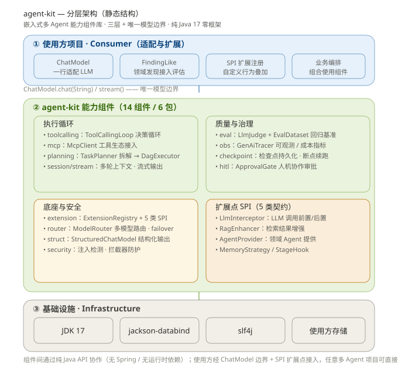

# agent-kit

> [English](README.md) | [中文](README.zh-CN.md) | [📖 在线文档](https://13liyunfei.github.io/agent-kit/zh/)

[](https://13liyunfei.github.io/agent-kit/zh/)

多 Agent 通用能力积木 —— 开箱即用、以 Maven 组件方式引入、扩展点自定义。

纯 Java 17，零框架依赖（仅 jackson-databind + slf4j），任何多 Agent 项目可直接引入。
覆盖企业级 Agent 应用常用能力域（工具调用 / 任务规划 / 评估 / 扩展 / 会话 / 流式 / 结构化输出 / MCP / 检查点 / 可观测 / 人机协作 / 路由 / 安全），收敛为**嵌入式算法组件库**。

构建与测试见 [BUILD.zh-CN.md](BUILD.zh-CN.md)。



## 引入

```xml
<dependency>
    <groupId>io.github.13liyunfei</groupId>
    <artifactId>agent-kit</artifactId>
    <version>0.1.0</version>
</dependency>
```

## 组件清单（17 包 / 14 能力域）

| 包 | 组件 | 能力 |
| --- | --- | --- |
| 包 | 组件 | 能力 |
| --- | --- | --- |
| `kit.model` | `OpenAiChatModel` / `OpenAiEmbeddingModel` / `NativeChatModel` / `ResilientChatModel` / `UsageStats` | 模型适配层（OpenAI 兼容：原生函数调用 / JSON mode / SSE 流式 / Embedding）+ 韧性包装（超时 / 重试退避 / 限流 / 成本指标） |
| `kit.toolcalling` | `AgentTool` / `ToolRegistry` / `ToolCallingLoop` / `NativeToolCallingLoop` / `ToolSchema` / `GuardedTool` | 双模式工具调用：prompt-JSON 决策循环 **或** 原生 tools 协议（并行调用 + 工具结果 role）；schema 校验 + 危险模式护栏 |
| `kit.graph` | `AgentGraph` / `AgentGraphBuilder` / `GraphState` | 状态化编排：节点 / 条件边 / 循环回边（步数守卫）/ 节点重试 / HITL 审批中断 / 检查点断点续跑 |
| `kit.planning` | `TaskPlanner` / `TaskPlan` / `DagExecutor` | LLM 任务拆解 DAG（id 唯一/依赖存在/Kahn 无环）+ 拓扑并行执行（上游失败下游跳过） |
| `kit.memory` | `ConversationMemory` / `InMemoryMemoryStrategy` / `FileMemoryStrategy` | 短期窗口 + 溢出自动摘要；可插拔长期记忆（文件 / 内存 / 自研） |
| `kit.rag` | `RagPipeline` / `TextSplitter` / `EmbeddingModel` / `VectorStore` / `Retriever` / `RagChatModel` | RAG 全链路：切分 → 向量化 → 索引 → 检索（top-k 余弦）→ RagEnhancer 重排链 → 上下文注入对话 |
| `kit.eval` | `LlmJudge` / `FindingLike` / `EvalDataset` / `EvalRunner` / `RagMetrics` | precision/recall/F1 + llm-as-judge + RAG 指标（上下文命中 / faithfulness / relevance）；命名基准集聚合回归 |
| `kit.session` / `kit.stream` | `ChatMessage` / `ChatSession` / `ChatStreams` | 多轮上下文窗口（条数 + token 预算裁剪）；流式（JDK Flow.Publisher） |
| `kit.struct` | `StructuredChatModel` | 结构化输出：JSON Schema 绑定 + 校验失败自动重试（类型安全契约） |
| `kit.mcp` | `McpClient` / `HttpMcpClient` / `McpToolAdapter` | MCP 客户端：stdio **和** Streamable HTTP 双传输；tools / resources / prompts（JSON-RPC 2.0） |
| `kit.checkpoint` | `CheckpointStore`（内存/文件） | 检查点持久化：崩溃恢复 / 断点续跑（也供 AgentGraph 使用） |
| `kit.obs` | `GenAiSpan` / `GenAiTracer` / `TracedChatModel` / `AggregateTracer` | 可观测性：GenAI span / 耗时 / token / 成本，聚合指标导出（MetricsSink） |
| `kit.hitl` | `ApprovalRequest` / `ApprovalGate` | 人机协作：提交审批 → 人工裁决 → 阻塞等待（亦可作为图的中断点） |
| `kit.router` | `ModelRouter` / `RoutingChatModel` | 多模型路由（优先级）+ 调用失败自动 failover |
| `kit.security` | `PromptInjectionDetector` / `SensitiveDataGuard` / `OutputGuardInterceptor` / `ToolSchemaValidator` | Prompt 注入检测 + 敏感数据脱敏（输出护栏）+ 工具参数校验，以 LlmInterceptor SPI 方式接入 |
| `kit.agent` | `Agent` / `AgentRuntime` / `SupervisorAgent` | 多 Agent 协作：Agent 间 Handoff 转交协议 + LLM 驱动 Supervisor 路由派发 |
| `kit.extension` | `ExtensionRegistry` + 5 类 SPI | order 织入序/同名覆盖/线程安全；`LlmInterceptor` / `RagEnhancer` / `AgentProvider` / `MemoryStrategy` / `StageHook` |
## 唯一模型边界：ChatModel

kit 不依赖任何具体 LLM 供应商，只认一个接口：

```java
public interface ChatModel {
    String chat(String prompt);                                   // 同步
    default Flow.Publisher<String> stream(String prompt) { ... }  // 流式（可覆盖）
}
```

你的项目一行适配即可接入（示例：接自研网关 / OpenAI SDK / 内部 MaaS）：

```java
ChatModel model = prompt -> myLlmGateway.chat(prompt); // 你的实现
```

## 扩展点（使用方自定义扩展）

实现 SPI 接口 → 注册到 `ExtensionRegistry` → 按 `order()` 升序织入（标准实现用大 order，自定义用小 order 叠加）。

| SPI | 作用 | 关键方法 |
| --- | --- | --- |
| `LlmInterceptor` | LLM 调用前置/后置（防注入 / 审计 / 纠偏） | `String before(prompt)` / `String after(prompt, response)` |
| `RagEnhancer<T>` | 检索结果增强（重排 / 去重 / 注入知识库） | `List<T> enhance(hits, query)` |
| `AgentProvider<A>` | 提供领域 Agent 实例 | `List<A> provide()` |
| `MemoryStrategy` | 记忆读写策略替换 | `Optional<String> get(key)` / `put(key, value)` |
| `StageHook` | 工作流阶段回调（追踪 / 轨迹 / 审计） | `void onStage(stage, ctx)` |

```java
ExtensionRegistry registry = new ExtensionRegistry();
registry.register(LlmInterceptor.class, new MyAuditInterceptor()); // 自定义扩展
List<LlmInterceptor> chain = registry.list(LlmInterceptor.class);   // 按 order 取链
```

## 最小使用示例

下方示例中的 `model` 即 `ChatModel` —— kit 唯一的模型边界，由使用方项目提供（一行 lambda 或自定义实现，见上文「模型边界」）。`chat(prompt)` 收到的 prompt 由 kit 组件构造（已含工具清单 + 决策 JSON 格式指令），你的网关只需原样转发请求/响应，**无需感知 MCP**：

```java
// 0. 模型：把自己的 LLM 网关适配成 kit 唯一的模型边界 ChatModel
//    prompt 由组件构造（工具清单 + 决策格式），原样转发即可，这里不感知 MCP
ChatModel model = prompt -> myLlmGateway.chat(prompt);   // 或 new OpenAiChatModel(key)

// 1. 工具调用循环：思考→决策→调用→观察→继续推理
ToolRegistry tools = new ToolRegistry();
tools.register(new BuiltinTools.CurrentTimeTool());                    // 内置：当前时间
McpClient mcp = McpClient.start("npx", "-y", "@modelcontextprotocol/server-github");
mcp.listTools().forEach(t -> tools.register(new McpToolAdapter(mcp, t))); // 挂载 MCP 工具

ToolCallingLoop loop = new ToolCallingLoop(model, tools, 5);  // 最多 5 轮，防死循环
// 第 1 轮：模型返回 {"action":"call_tool","tool":"current_time","arguments":{}}
// 循环执行工具 → 观察拼回 → 再问模型；直到模型返回 {"action":"finish","answer":"..."}
LoopResult r = loop.run("现在几点？顺便查下这个仓库的 star 数", "PR #42 审查背景");
System.out.println(r.answer());      // 最终结论（模型 finish 时给出）
System.out.println(r.toolCalls());   // 实际调用过的工具链（审计用）

// 2. 任务拆解 + DAG 并行执行
TaskPlan plan = new TaskPlanner(model).plan("审查 PR #42", List.of("Logic", "Security"));
Map<String, DagExecutor.TaskResult> results = new DagExecutor(executor)
        .execute(plan, node -> runAgent(node.assignee(), node.description()));

// 3. 评估 + 回归基准（ground-truth precision/recall）
LlmJudge<MyFinding> judge = new LlmJudge<>(model);
EvalReport report = new EvalRunner().run(dataset, case -> produceFindings(case));
```

## 本次新增能力

- **原生函数调用** — `NativeChatModel` + `NativeToolCallingLoop`：走供应商原生 `tools` 协议的并行工具调用 + 工具结果 role 消息；不支持时自动回退 prompt-JSON 模式。
- **状态化编排** — `AgentGraph`：条件边、循环回边（步数守卫）、节点级重试、HITL 审批中断、检查点断点续跑。
- **记忆 + RAG** — `ConversationMemory`（溢出自动摘要）、文件/内存 `MemoryStrategy`、RAG 全链路（`TextSplitter` / `EmbeddingModel` / `VectorStore` / `Retriever` / `RagChatModel`）。
- **生产工程化** — `ResilientChatModel`（超时 / 重试退避 / 限流）、`UsageStats` + `MetricsSink` 成本核算；OpenAI 兼容适配器基于 JDK `HttpClient` 实现（零新增依赖）。
- **MCP Streamable HTTP** — `HttpMcpClient` 支持远程 MCP 服务器（JSON + SSE），两个传输均补齐 `resources` / `prompts` 方法。
- **安全与评测** — 敏感数据脱敏输出护栏、工具调用参数校验、RAG 评测指标。
- **多 Agent 运行时** — `Agent` / `AgentRuntime` 的 Handoff 转交协议与 `SupervisorAgent` 路由派发。


## 测试

```bash
mvn -f agent-kit/pom.xml test   # 78 例：循环语义 / DAG 拓扑与环拒绝 / 评估聚合 / 扩展点织入 /
                                # 会话裁剪 / 结构化重试 / MCP 全链路 / 检查点恢复 / HITL 审批 /
                                # 路由 failover / 注入防护
```

## 采用者

- **[code-review-agent](https://gitee.com/liyunfei2030/code-review-agent)** —— 多 Agent 协同代码审查引擎（Java 17 / Spring Boot 3.3）。以 Maven 依赖方式接入 agent-kit，落地其工具调用循环、任务拆解 DAG、LLM 评估与扩展点能力，是组件库嵌入式接入的生产级参考实现。

后续有新项目接入，将在此持续补充。

## License

[MIT](LICENSE) © 2026 liyunfei2030
